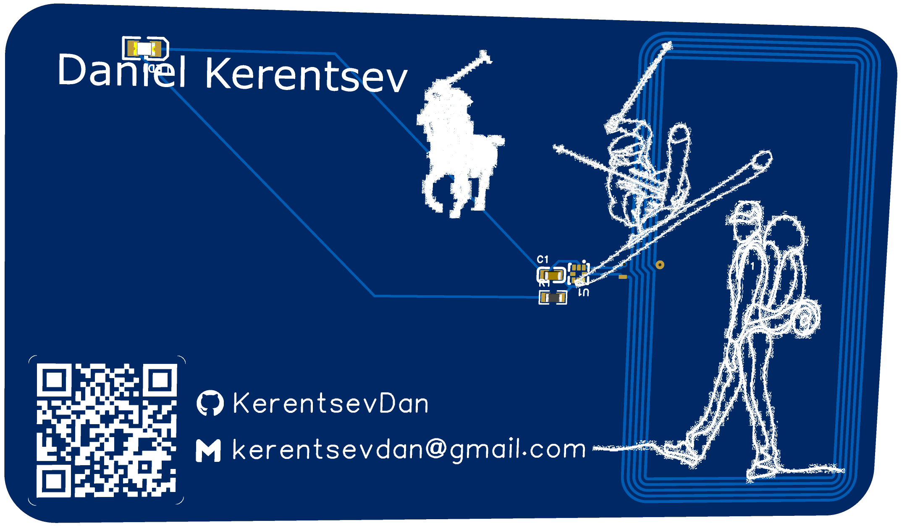
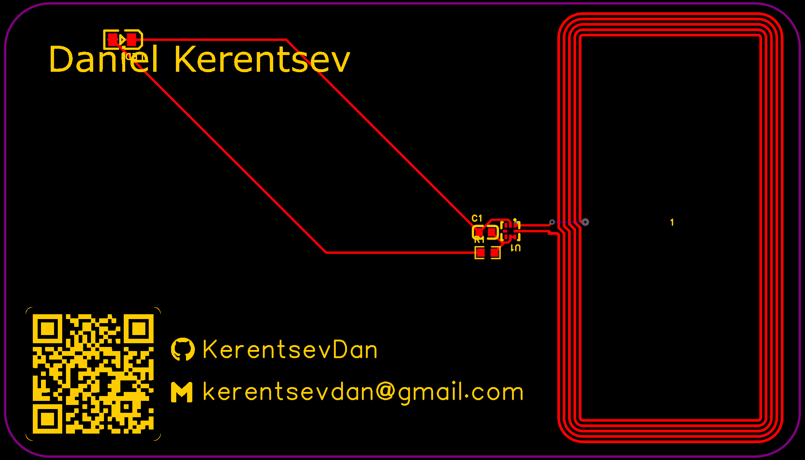
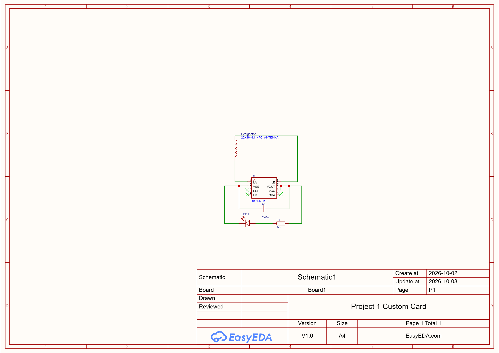

# NFC PCB Business Card

**Custom PCB business card designed in EasyEDA**    
  
## 3D Board Design  

## Features  
- NFC chip that can store a URL or contact info.
- Antenna lets a smartphone communicate with the NFC chip
- LED circuit includes a current-limiting resistor.   
- QR code linking to my LinkedIn.  
- Standard size for business card.

## Components  
|PART|VALUE|PART NUMBER|PURPOSE|  
|----|---|---|---| 
| NFC CHIP | N/A | NT3H2111W0FHKH | Stores URL or contact Data |  
| RESISTOR | 47 Ω | 0603WAF470JT5E | Limits LED current |  
| CAPACITOR | 220 nF | CL10B224KA8NNNC | Smooths power harvested from NFC chip |  
| LED | RED | KT-0805Y | Indicator |  

## Design Process
1. Created first ever schematic on EasyEDA  
2. Placed all the components, routed the board layout including the antenna.    
3. Added custom QR code, images, and rendered the board as a 3D model.

## PCB Layout
  

## Schematics
  

## Credits  
Based on [Hacker Card](https://jams.hackclub.com/jam/hacker-card)  
I built the schematic and layout in EasyEDA, created the QR code, and designed the board artwork.

## Tools  
EasyEDA  
QR Code Generator  

## Author  
Daniel Kerentsev |  [Linkedin](linkedin.com/in/danielkerentsev)  

## About Me  
I'm an Electrical Engineering sophomore at the University of Massachusetts Amherst. This was my first PCB design project and my first time using EasyEDA. I am a beginner in this area but hope to progress quickly moving into building more complex hardware and embedded projects.

